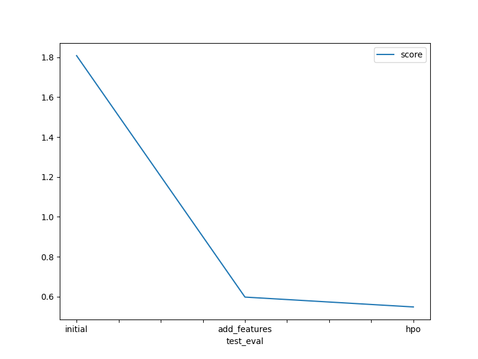
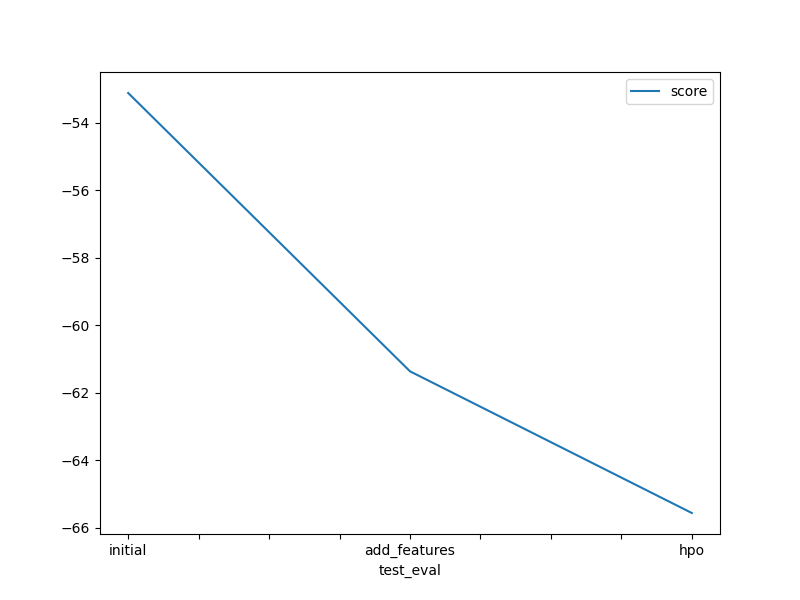

# Report: Predict Bike Sharing Demand with AutoGluon Solution
#### Nadeem Ahmed Ansari

## Initial Training
### What did you realize when you tried to submit your predictions? What changes were needed to the output of the predictor to submit your results?

Round negative count values into zero
Round the numbers in count column to zero

### What was the top ranked model that performed?
The WeightedEnsemble_L3 model

## Exploratory data analysis and feature creation
### What did the exploratory analysis find and how did you add additional features?
1.Time series analysis shows that:
    There are data missing for last 10 days of the month. i.e; from 20th.
    The changes in the demand of every hour during weekday and weekend.
2.Correlation graph showed the high correlation between month and seasonality. So, removed seasonality from features.
3.Categorzed continues features like temperature, humidity, wind etc.

### How much better did your model preform after adding additional features and why do you think that is?
The model's performance saw a substantial 25% improvement after incorporating the additional feature. This underscores the importance of leveraging domain knowledge to enhance predictive accuracy. By integrating relevant features informed by the domain, we can further refine our models and achieve even more precise predictions.

## Hyper parameter tuning
### How much better did your model preform after trying different hyper parameters?
I observed a slight improvement in the Kaggle score. Fine-tuning these parameters can have a significant impact on model performance, even if the change is subtle. Hyper parameter tuning was useful in some cases but it did not improve the performance of the model much, some configurations where useful but others harmed the model performance.
### If you were given more time with this dataset, where do you think you would spend more time?

In my future work, I'll delve deeper into understanding the dataset through exploration. Additionally, I'll invest extra effort into researching and experimenting with hyperparameters to ensure optimal model performance. 

### Create a table with the models you ran, the hyperparameters modified, and the kaggle score.
|model|hpo1|hpo2|hpo3|score|
|--|--|--|--|--|
|initial|default|default|default|1.80757|
|add_features|default|default|default|0.59830|
|hpo|'CAT': {'iterations': 10000},'RF': {'n_estimators': 300},'XT': {'n_estimators': 300}|GB: num_boost_round=100, num_leaves(lower=26, upper=66, default=36)|"scheduler: local, searcher: auto"|0.54894|

### Create a line plot showing the top model score for the three (or more) training runs during the project.

### Create a line plot showing the top kaggle score for the three (or more) prediction submissions during the project.

## Summary
TIn this project, we learned about AutoML using AutoGluon, which automates machine learning tasks. We also saw how exploring and improving the quality of our data can have a big impact on our model's performance. This aligns with the idea of focusing more on data quality than just the model itself, which is gaining attention in the AI and ML community. By applying what we've learned, we built a regression model and achieved a good score on Kaggle. It was a great learning experience!
